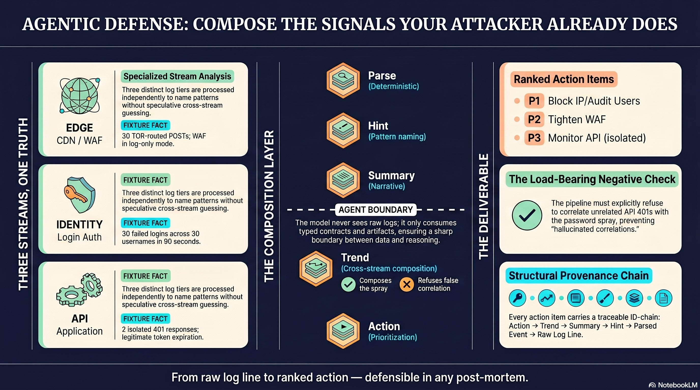
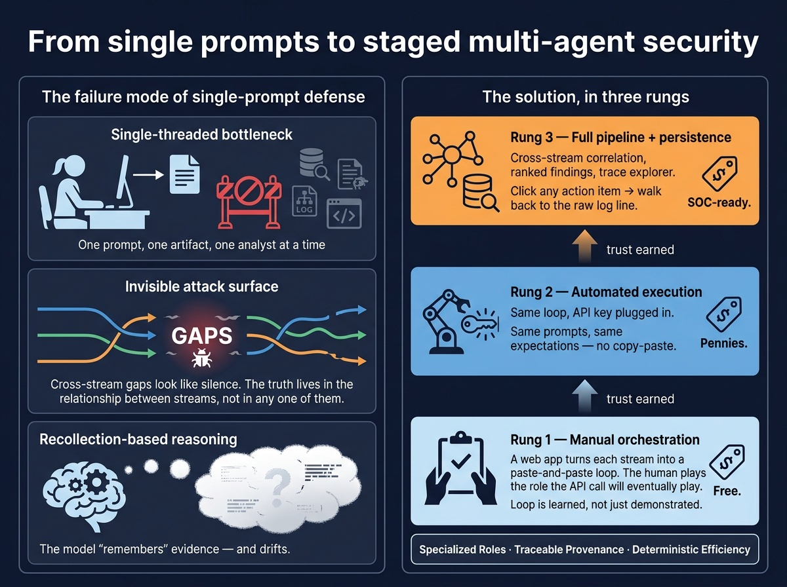
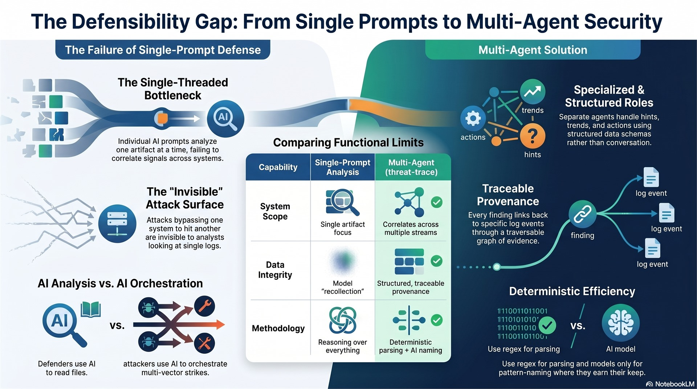

# threat-trace

> **Rehearse what your AI security agent will do — before you deploy it.**
>
> A multi-agent log-analysis pipeline you can walk through step by
> step, in your browser, with every reasoning seam visible. BYOK
> Anthropic key, no install, no server, no telemetry.

In the next year, "AI SOC analyst" agents will move from pilot to
production at most enterprises. The 80-point gap between *piloting an
agent* and *trusting an agent in production* is a trust calibration
problem, not a model capability problem. threat-trace is a working
reference for closing that gap: a cross-stream investigation
pipeline you can rehearse end-to-end, click-by-click, with full
provenance from every recommended action back to the raw log lines
that justified it.

The attackers running coordinated campaigns against your stack right
now are multi-step, multi-stream, adaptive. Defenders' AI tooling is
mostly: paste a log into a chat AI, ask "what stands out?". That's a
single-completion analyst on a specialty task. It's not a defense
system. threat-trace is what the composed-signals version looks
like — running, working, with every seam visible.



---

## What's in here

A working multi-agent log-analysis pipeline that demonstrates
**cross-stream correlation done correctly** — and, just as
importantly, demonstrates how it **doesn't hallucinate** when two
unrelated 4xx errors happen to share a time window with a real
attack.

- **Three log streams** of synthetic data from a fictional company
  mid-attack: an **edge** tier (CDN / WAF; fixture data shaped from
  Cloudflare logs — adapts to Fastly, Akamai, CloudFront, …), an
  **identity** tier (login / authentication; fixture data shaped from
  Auth0 logs — adapts to Okta, Cognito, Keycloak, Entra ID, …), and an
  **api** tier (application traffic; fixture data shaped from Azure App
  Insights — same shape a Node service, microservices stack, or .NET
  monolith would all emit through equivalent OpenTelemetry-style
  logging).
- **Three discrete agents** reasoning over each stream in isolation.
  Cross-stream correlation happens at exactly one designated layer.
- **Load-bearing negative check.** Two routine token-expiration 401s
  in the api tier *must not* be lumped in with the unrelated
  password spray happening at the same time. The expectation panel
  evaluates this on every run.
- **Provenance from finding to raw log line.** Every recommended
  action carries its evidence chain back to the specific log lines
  that justified it. Click any action; walk the chain. **Defensible
  in any post-mortem, not just a demo.**



---

## Run it

### Hosted (fastest path)

A reference deployment runs at *(URL pending — see
[docs/deploy/cloudflare-pages.md](./docs/deploy/cloudflare-pages.md)
for self-hosting on Cloudflare Pages)*. Bring your own Anthropic
key; nothing leaves your browser except the calls to
`api.anthropic.com`.

Click **Run investigation** in the header. Sonnet 4 walks the full
pipeline — hint extraction per stream, then per-stream summaries, a
cross-stream trend, and prioritized action items — in about 10–12
seconds.

### Single-file (offline-friendly)

Open `dist/threat-trace.html` in any modern browser. Double-click in
Finder / Explorer, or drag it onto a browser window. That's the
whole installation. Single self-contained file, no server, no
network calls until you Run something.

The web app is self-explanatory — it tells you what to do at every
step. Manual mode (free) walks you through pasting prompts into any
chat AI of your choice and pasting JSON replies back. API mode plugs
an Anthropic key in (memory-only, never written to disk, never
exported) and runs the entire pipeline automated.

You can also try the project's hosted demo at
**[steppeintegrations.com/articles/threat-trace](https://steppeintegrations.com/articles/threat-trace/)**.

### Build from source

```sh
npm install
npm run build
```

Produces `dist/threat-trace.html` (the standalone single file) and
`dist/index.html` (identical content for use with `npx vite preview
--host 127.0.0.1` if you want to verify in a local server first).

`npm run dev` for hot-reload development. `npm run test:parsers` for
the parser regression suite.

---

## Architecture

```
   ┌─────────────┐  ┌─────────────┐  ┌─────────────┐
   │    Edge     │  │  Identity   │  │     API     │
   └──────┬──────┘  └──────┬──────┘  └──────┬──────┘
          │                │                │
   ┌──────▼──────┐  ┌──────▼──────┐  ┌──────▼──────┐
   │  Parse      │  │  Parse      │  │  Parse      │     deterministic
   └──────┬──────┘  └──────┬──────┘  └──────┬──────┘
          │                │                │
   ┌──────▼──────┐  ┌──────▼──────┐  ┌──────▼──────┐
   │  Hint       │  │  Hint       │  │  Hint       │     model
   └──────┬──────┘  └──────┬──────┘  └──────┬──────┘
          │                │                │
   ┌──────▼──────┐  ┌──────▼──────┐  ┌──────▼──────┐
   │  Summary    │  │  Summary    │  │  Summary    │     model (staged)
   └──────┬──────┘  └──────┬──────┘  └──────┬──────┘
          │                │                │
          └────────────────┼────────────────┘
                           ▼
                   ┌─────────────┐
                   │  Trend      │  ← cross-stream (staged)
                   └──────┬──────┘
                          ▼
                   ┌─────────────┐
                   │   Action    │  ← prioritized + cited (staged)
                   │   items     │
                   └─────────────┘
```

**Parsing is fully deterministic.** Each parser emits a normalized
`ParsedEvent` regardless of source. The agent boundary is sharp —
the model only ever sees structured events, never raw logs.
Cross-stream correlation happens at exactly one layer (the trend
agent), not bleeding across every prompt.

The architectural claim:
**deterministic skeleton, model only where pattern-naming earns its
keep**. Typed contracts, parsers, expectation checks, and ID
composition are all deterministic and reusable. The hint, summary,
trend, and action stages are model-backed — each is a single
completion with a typed contract on the other side. Nothing about
the skeleton requires the model to behave; the skeleton catches the
model when it doesn't.

For the deeper read, see the architectural source-of-truth in
[HANDOFF.md](./HANDOFF.md).

---

## What ships today

The full pipeline is live. Click **Run investigation** in the header
and watch all three stages execute end-to-end:

- **Stage 1 + 2 — hint extraction.** Per-stream anomaly hints from
  three log sources (edge, identity, api). Manual paste-through-any-
  chat-AI mode (free) and API mode (plug in your Anthropic key)
  produce identical downstream pipelines. Editable prompts in API
  mode — try weakening a check and watch the expectation panel
  react.
- **Stage 3a — per-stream summaries.** Each stream's hints get
  composed into a focused narrative grouped by actor fingerprint,
  with the load-bearing rule that benign 4xx responses
  (`FailureReason: "TokenExpired"`) never get flagged as attack
  signal.
- **Stage 3b — cross-stream trend.** The first cross-stream call.
  Composes the three summaries into time-aligned, actor-fingerprinted
  patterns. Skeptical: rejects coincidence, doesn't invent
  correlations.
- **Stage 3c — action items.** Translates each genuine trend into
  prioritized (P1/P2/P3), owner-assigned (devops / security / api /
  platform), rationale-cited recommendations.

Every recommended action carries its evidence chain back to the
specific log lines that justified it. Defensible in a post-mortem,
not just a demo.

In API mode the **Run investigation** button parallelizes within
each stage and runs the whole pipeline in about 10–12 seconds. In
Manual mode each stage's prompt unlocks once the prior stage has a
parseable response, so you can walk the entire investigation
yourself by pasting into Claude.ai / ChatGPT / any chat AI.



---

## Why it's free

Every defender running a stack against the modern bot wave should
already have tooling that composes signals across systems and traces
every finding back to a raw log line. Most don't. That's the gap
this closes for anyone who walks it.

The methodology that made this small enough to give away — typed
contracts at every seam, model only where pattern-naming earns its
keep, observability first-order — is the same methodology any
serious defender's tooling already needs. Building this isn't the
hard part. Knowing it needs to exist is.

The architectural deck (~5 minute read) lives at
**[steppeintegrations.com/articles/threat-trace](https://steppeintegrations.com/articles/threat-trace/)**.

---

## Take it. Fork it. Beat me to the next slice.

The handoff guide ([DEV.md](./DEV.md)) has prompts an engineer can
paste into Claude Code or Cursor to extend the pipeline:

- **Track A — done.** The Stage 3 surfaces (per-stream summaries
  → cross-stream trend → ranked action items) ship live in the
  current build.
- **Track B** — add SQLite persistence (better-sqlite3 in dev,
  sql.js or OPFS-backed SQLite in browser).
- **Track C** — author additional incident fixtures (a 7-day
  timeline beats the 30-minute tutorial fixture for buyer demos).
- **Track D — a trace explorer.** A per-action-item drill-down
  view that walks any recommendation back to the trends, summaries,
  hints, and raw log lines that produced it. The component exists
  (`src/components/TraceExplorer.tsx`) but isn't yet surfaced in
  the main flow.
- **Track E — port to a non-security domain.** The pipeline
  skeleton (parsers → hints → summaries → trend → actions) is
  vendor- and domain-agnostic. Swap parsers + system prompts +
  expectation checks and the same architecture serves AML alert
  triage, medical second-read, claims adjudication, etc. See
  [docs/strategy/](./docs/strategy/) for the cross-domain map.

Each prompt is self-contained.

---

## What's NDA-safe

Everything is fictional. The attack pattern encoded in
`fixtures/tutorial/` is the *kind* of thing that happens to
companies with this stack — TOR-sourced password sprays against
custom identity-tenant domains fronted by an edge tier with the
WAF in log mode — but no real company, no real incident, no real
credentials.

If you adapt this for your own environment, the three parsers
(`parsers/edge.ts`, `parsers/identity.ts`, `parsers/api.ts`) take
your raw log shapes and emit the same `ParsedEvent` contract. The
fixture data ships in well-documented public shapes (Cloudflare
GraphQL Analytics, Auth0 tenant logs, Azure App Insights AppRequest)
because those are the most reviewable places to start; the parser
contract itself is vendor-agnostic and adapts to Fastly, Akamai,
Okta, Cognito, Keycloak, Entra ID, OpenTelemetry-style application
logs, or anything else that emits structured events. Everything
above the parsers is shape-agnostic.

---

## Where to look next

| You are… | Read… |
|---|---|
| Anyone who wants to walk the demo | Open `dist/threat-trace.html` in your browser, or visit [steppeintegrations.com/articles/threat-trace](https://steppeintegrations.com/articles/threat-trace/). |
| A developer who needs to build, test, ship, or extend | [DEV.md](./DEV.md) |
| A developer who wants the full architectural context | [HANDOFF.md](./HANDOFF.md) |
| A developer wondering "why was X built that way" | [docs/adr/](./docs/adr/README.md) — append-only architecture decision records |
| A developer who wants the Sprint 1 story | [docs/retro/sprint-1.md](./docs/retro/sprint-1.md) — what shipped, what went well, what didn't, what's next |
| A founder/PM scoping the next phase | [docs/strategy/](./docs/strategy/README.md) — 11 follow-up briefs (uniqueness check, vertical wedges, GTM, audit play) |
| Anyone deploying their own hosted version | [docs/deploy/cloudflare-pages.md](./docs/deploy/cloudflare-pages.md) — three-path Cloudflare Pages guide |
| Anyone who wants the narrative version with diagrams | [docs/launch/Architecting_Agentic_Defense.pdf](./docs/launch/Architecting_Agentic_Defense.pdf) — 12-slide deck (GitHub renders it inline) |

---

## License

MIT. See [LICENSE](./LICENSE).

Built by [Steppe Integrations](https://steppeintegrations.com).
Reach out: <derek@steppeintegrations.com>.
